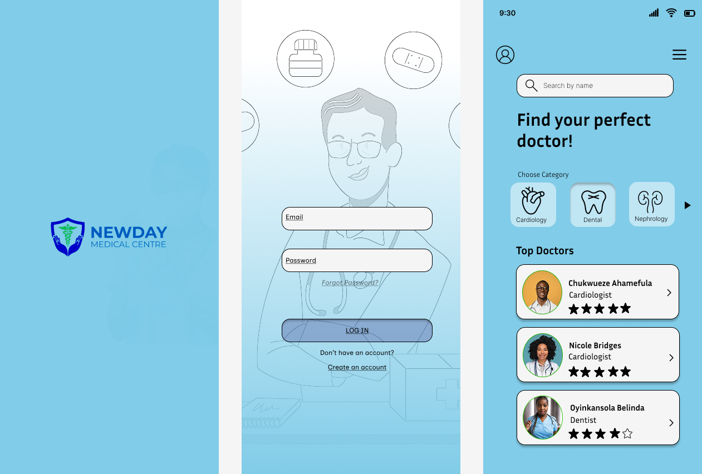

# **Hospital Prototype App**

## **Project Overview**

This repository contains the wireframe design of a hospital prototype app, created using Figma. This project serves as a test of my wireframing skills. The app is designed to showcase the following features:

1. **Sign up or login** functionality for user accounts.
2. **Booking appointments** with medical personnel across different departments.
3. **E-medicine chat** feature for communication with doctors.

While the wireframe focuses on design, the future implementation will involve front-end and back-end features, as outlined below.

The wireframe consists of 3 main pages:

1. **Logo Page** – The first page displayed upon opening the app.
2. **Sign Up / Sign In Page** – For user registration and login.
3. **Departments and Doctors Page** – Displays various medical departments and top-rated doctors.

## **Screenshots**



[Click here to view the Figma design](https://www.figma.com/proto/lTdKIwmMDjpli6tAABGGdQ/newday?t=JQa5VZcwgcg3ZbRI-1)


### **Page Details**

#### 1. **Logo Page**
- **Purpose:** The first page shown when the user opens the app.
- **Features:**
  - Displays the hospital logo.
  - Branding and app name.
  - Transition to the sign-up/sign-in page after a brief display.

#### 2. **Sign Up / Sign In Page**
- **Purpose:** Allows users to either sign up with a new account or log in to an existing one.
- **Features:**
  - Email and password input fields.
  - Sign-up button for new users.
  - Login button for returning users.
  - Forgot password link for account recovery.

#### 3. **Departments and Doctors Page**
- **Purpose:** Displays a list of available departments and top doctors.
- **Features:**
  - List of departments such as Dental, Cardiology, etc.
  - A list of top-rated doctors with their star ratings.
  - A search bar to search for specific departments or doctors directly.
  - Book appointment button for each doctor.

## **Future Implementation**

### **Front-End (Planned)**
- **Development Tool:** The front-end will be developed using [React]
- **Features:** 
  - User interface for the sign-up/sign-in process.
  - Displaying the list of departments and doctors.
  - Book appointment functionality.
  - Real-time chat interface for e-medicine consultations.

### **Back-End (Planned)**
- **Development Tool:** The back-end will be implemented using [Node.js]
- **Database:** MongoDB will be used to store user data, appointment information, and chat history.
- **Features:** 
  - User authentication for account management.
  - Booking system for appointments with medical personnel.
  - Real-time e-medicine chat feature for communication between doctors and patients.

## **Installation**

1. Clone this repository to your local machine:

   ```bash
   git clone https://github.com/yourusername/hospital-prototype-app.git
